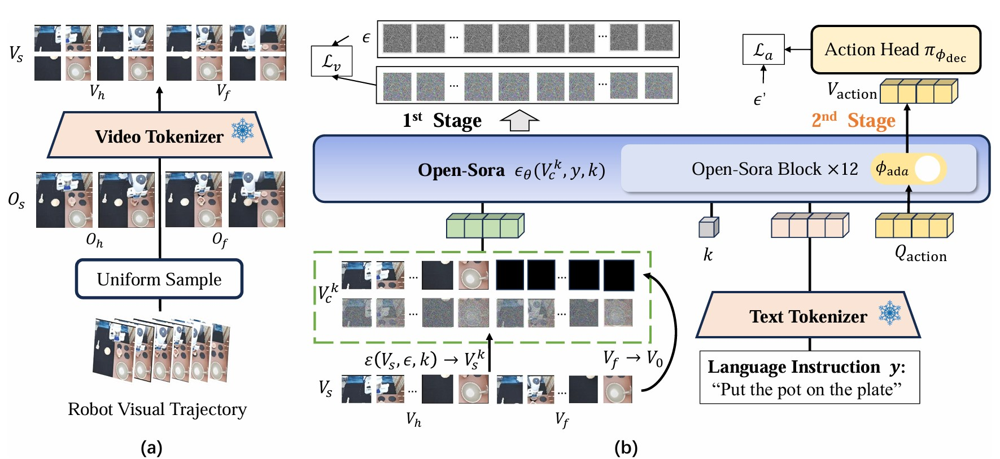

# VidMan
Code for "VidMan: Exploiting Implicit Dynamics from Video Diffusion Model for Effective Robot Manipulation"
## VidMan: Exploiting Implicit Dynamics from Video Diffusion Model for Effective Robot Manipulation

[Project Website](https://jirufengyu.github.io/VidMan/) || [Arxiv](https://arxiv.org/abs/2411.09153) || NeurIPS 2024

Youpeng Wen†, Junfan Lin†, Yi Zhu, Jianhua Han, Hang Xu, Shen Zhao, Xiaodan Liang

†Equal Contribution
<p align="center">

</p>

VidMan employs a dual-stage training strategy: in the first stage, the Dynamics-aware Visionary Stage, we enable the model to forecast and imagine potential future trajectories based on historical observations, leveraging the multi-frame prediction capability of the video diffusion model. Through this stage, the model is optimized to understand the dynamics of the environment. In the second stage, the Dynamics-modulated Action Stage, we introduce a lightweight layer-wise adapter to seamlessly integrate the visionary predictive stage with fast, adaptive action prediction. This approach decouples the knowledge of the world and embodiment into distinct processes while ensuring seamless integration through the training and utilization of shared parameters.

## Abstract

Recent advancements utilizing large-scale video data for learning video generation models demonstrate significant potential in understanding complex physical dynamics. It suggests the feasibility of leveraging diverse robot trajectory data to develop a unified, dynamics-aware model to enhance robot manipulation. However, given the relatively small amount of available robot data, directly fitting data without considering the relationship between visual observations and actions could lead to suboptimal data utilization. To this end, we propose VidMan (Video Diffusion for Robot Manipulation), a novel framework that employs a two-stage training mechanism inspired by dual-process theory from neuroscience to enhance stability and improve data utilization efficiency. Specifically, in the first stage, VidMan is pre-trained on the Open X-Embodiment dataset (OXE) for predicting future visual trajectories in a video denoising diffusion manner, enabling the model to develop a long horizontal awareness of the environment's dynamics. In the second stage, a flexible yet effective layer-wise self-attention adapter is introduced to transform VidMan into an efficient inverse dynamics model that predicts action modulated by the implicit dynamics knowledge via parameter sharing. Our VidMan framework outperforms state-of-the-art baseline model GR-1 on the CALVIN benchmark, achieving a 11.7% relative improvement, and demonstrates over 9% precision gains on the OXE small-scale dataset. These results provide compelling evidence that world models can significantly enhance the precision of robot action prediction.

## Installation
- Create a virtual environment and install python=3.9 and pytorch=2.2.0.
- Follow the installation steps in [the CALVIN repo](https://github.com/mees/calvin) to install the CALVIN environment.
- Install this repository:
```
git clone https://github.com/jirufengyu/VidMan.git
cd ./VidMan
pip install -r requirements.txt
```
- Install other dependencies:
```
apt-get install -y libegl1-mesa libegl1
apt-get install -y libgl1
apt-get install -y libosmesa6-dev
apt-get install -y patchelf
```

## Evaluation
- Download [SD2 pretrained encoder](https://huggingface.co/stabilityai/sd-vae-ft-ema) and our [pretrained checkpoint](https://huggingface.co/jirufengyu/vidman), then put them in ```./pretrained_models```
- Evaluate by running the following command.
```
bash scripts/eval.sh
```

## Citation
If you find this code useful in your work, please consider citing.
```shell
@inproceedings{wenvidman,
    title={VidMan: Exploiting Implicit Dynamics from Video Diffusion Model for Effective Robot Manipulation},
    author={Wen, Youpeng and Lin, Junfan and Zhu, Yi and Han, Jianhua and Xu, Hang and Zhao, Shen and Liang, Xiaodan},
    booktitle={The Thirty-eighth Annual Conference on Neural Information Processing Systems},
    year={2024}
}
```
